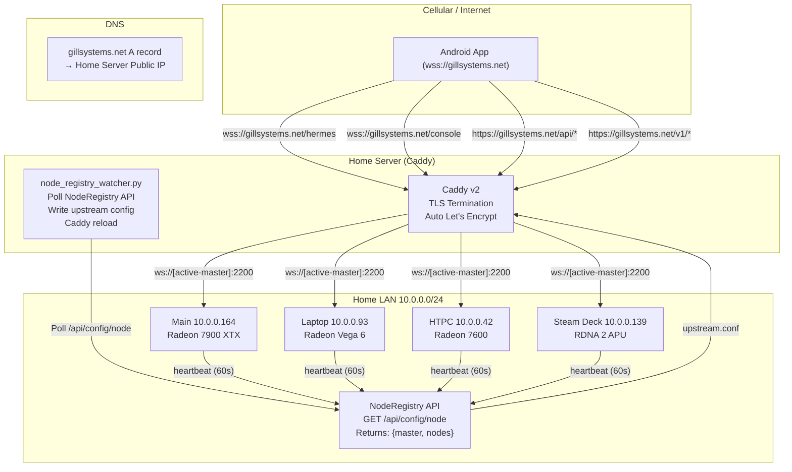
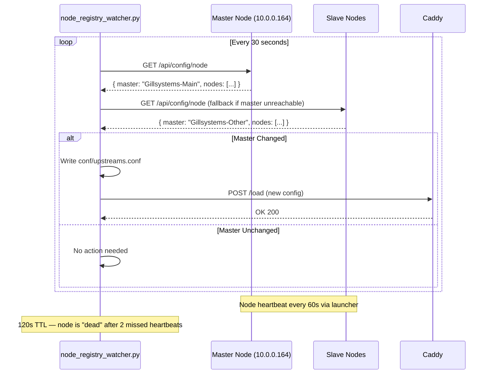

# Caddy WSS Node Registry — Implementation Plan

## Overview

Configure Caddy at `gillsystems.net` to read the Hermes NodeRegistry API on each LAN node, determine the active master node, and dynamically route WebSocket Secure (WSS) and HTTP traffic to it. This enables the Android companion app to connect via `wss://gillsystems.net` without hardcoded LAN IPs.

---

## Architecture

### Current State

```
Android App --ws://10.0.0.93:2200/hermes--> [Hardcoded LAN IP, ws://]
                                            - No TLS
                                            - No failover
                                            - Hardcoded to laptop
```

### Target State



---

## Components

### 1. Node Registry API (Already Exists)

**File:** [`gateway/platforms/node_registry.py`](../Gillsystems-Commanders-Hermes/gateway/platforms/node_registry.py)

| Endpoint | Method | Description |
|----------|--------|-------------|
| `/api/config/node` | GET | List all active nodes + current master |
| `/api/config/node/register` | POST | Register a node (called by launcher) |
| `/api/config/node/heartbeat` | POST | Refresh a node's TTL (120s window) |
| `/api/config/node/{node_name}` | DELETE | Unregister a node on shutdown |

**Response format (GET):**
```json
{
  "nodes": [
    {
      "node_name": "Gillsystems-Main",
      "lan_ip": "10.0.0.164",
      "port": 2200,
      "gpu": "Radeon 7900 XTX",
      "hostname": "Gillsystems-Main",
      "last_seen": 1717000000.0,
      "ttl": 120
    }
  ],
  "master": {
    "node_name": "Gillsystems-Main",
    "lan_ip": "10.0.0.164",
    "port": 2200,
    "gpu": "Radeon 7900 XTX",
    "hostname": "Gillsystems-Main",
    "last_seen": 1717000000.0,
    "ttl": 120
  }
}
```

The master node is defined as **the most recently seen active node** (max `last_seen`).

### 2. Caddy Reverse Proxy (New)

**File:** `Caddyfile` (new, in gillsystems.net repo root)

Caddy terminates TLS (auto Let's Encrypt via DNS challenge or HTTP-01) and proxies WSS/HTTP to the active master node.

### 3. Node Registry Watcher Script (New)

**File:** `scripts/node_registry_watcher.py` (new, companion script)

A Python script that:
1. Maintains a static list of all 4 LAN nodes (their IPs are known/static LAN DHCP reservations)
2. Polls `GET /api/config/node` on each node every 30 seconds
3. Identifies the active master from the response
4. Writes the master's LAN IP + port to `conf/upstreams.conf` (Caddy-compatible import)
5. Triggers Caddy graceful reload via admin API `POST /load`

### 4. Caddy Import Snippet (Generated)

**File:** `conf/upstreams.conf` (auto-generated by watcher)

Contains the active reverse proxy directives targeting the current master node.

### 5. Android Client Configuration Update

**File:** `app/src/main/java/.../WebSocketClient.kt`

Change from hardcoded LAN IP to `wss://gillsystems.net`.

---

## Ports & Routes

| Ingress (Caddy) | Target (Master Node) | Protocol | Description |
|-----------------|---------------------|----------|-------------|
| `wss://gillsystems.net/hermes` | `ws://[master]:2200/hermes` | WebSocket | Android chat |
| `wss://gillsystems.net/console` | `ws://[master]:2200/console` | WebSocket | Console streaming |
| `https://gillsystems.net/api/config/*` | `http://[master]:2200/api/config/*` | HTTP | Node/Engine config |
| `https://gillsystems.net/v1/*` | `http://[master]:2200/v1/*` | HTTP | OpenAI-compatible API |
| `https://gillsystems.net/health` | `http://[master]:2200/health` | HTTP | Health check |

---

## Implementation Steps

### Step 1: Create the Caddyfile

Define the base reverse proxy configuration in `Caddyfile` at the root of the `gillsystems.net` repo.

Key considerations:
- Caddy auto-TLS via Let's Encrypt using the `tls` directive (or `email` global option)
- `reverse_proxy` with WebSocket support (Caddy auto-detects WebSocket upgrades via `Upgrade: websocket` header)
- Use `import` directive to include the dynamically-generated upstream configuration
- Handle path-based routing with `handle_path` or `@path` named matchers
- Set appropriate `header_up` directives to forward `X-Forwarded-For`, `X-Real-IP`, etc.
- `flush_interval -1` for WebSocket streaming to ensure real-time delivery

### Step 2: Create the Node Registry Watcher Script

Create `scripts/node_registry_watcher.py` that:
- Accepts a `--nodes` argument (comma-separated list of LAN IPs) or reads from a config file
- Uses Python's `urllib` or `aiohttp` to poll each node's `/api/config/node`
- Handles timeouts, connection failures, and partial responses gracefully
- Determines master (the one the NodeRegistry itself reports as master, or fallback to highest `last_seen`)
- Writes `conf/upstreams.conf` with Caddy-compatible reverse proxy directives
- Triggers Caddy reload via `POST /load` on Caddy admin API (default `127.0.0.1:2019`)
- Implements configurable poll interval (default 30s)
- Logs to stdout + optionally to a file

### Step 3: Create the Caddy Upstream Config Template

The watcher script writes `conf/upstreams.conf` which the `Caddyfile` imports.

Generated format:
```
# Auto-generated by node_registry_watcher.py
# Master: {node_name} at {lan_ip}:{port}
# Timestamp: {timestamp}

handle_path /hermes/* {
    reverse_proxy {lan_ip}:{port} {
        header_up X-Forwarded-For {remote_host}
        header_up X-Real-IP {remote_host}
    }
}

handle_path /console/* {
    reverse_proxy {lan_ip}:{port} {
        header_up X-Forwarded-For {remote_host}
        header_up X-Real-IP {remote_host}
    }
}

handle_path /api/config/* {
    reverse_proxy {lan_ip}:{port} {
        header_up X-Forwarded-For {remote_host}
        header_up X-Real-IP {remote_host}
    }
}

handle_path /v1/* {
    reverse_proxy {lan_ip}:{port} {
        header_up X-Forwarded-For {remote_host}
        header_up X-Real-IP {remote_host}
    }
}

handle_path /health {
    reverse_proxy {lan_ip}:{port} {
        header_up X-Forwarded-For {remote_host}
        header_up X-Real-IP {remote_host}
    }
}
```

### Step 4: Update Android WebSocket Client

Modify `WebSocketClient.kt` to:
- Default host: `"gillsystems.net"` (from `"10.0.0.93"`)
- Default port: `443` (WSS default, was `2200`)
- Use `wss://` scheme (Ktor handles this via `wss://` URL prefix or TLS config)
- Add TLS configuration for Ktor CIO engine (trust system CA certs)

### Step 5: Configure DNS & NAT

- **DNS:** Add/update `A` record for `gillsystems.net` pointing to the home server's public IP
- **Port Forwarding:** Forward ports 443 (HTTPS/WSS) on the router to the Caddy server's LAN IP
- **Dynamic DNS:** If the public IP is not static, configure DDNS (e.g., DuckDNS, No-IP) or use Caddy's DNS challenge with a DDNS provider

### Step 6: Setup & Service Management

- **Windows:** Install as a Windows Service via `nssm` or Task Scheduler
  - Caddy as a service
  - Watcher script as a service
- **Startup:** Configure both services to auto-start on boot
- **Firewall:** Allow port 443 inbound on the Windows Firewall

### Step 7: Verification & Testing

- Verify Caddy TLS certificate issued by Let's Encrypt
- Verify WebSocket upgrade works: `wscat -n -c wss://gillsystems.net/hermes` (requires auth)
- Verify node failover: Stop master node, verify watcher detects new master, Caddy reloads, traffic routes to new node
- Verify Android client connects and works over cellular (not just WiFi)

---

## Data Flow: Master Node Detection



---

## Files to Create/Modify

### New Files

| File | Description |
|------|-------------|
| `Caddyfile` | Main Caddy reverse proxy configuration |
| `conf/upstreams.conf` | Auto-generated upstream config (gitignored) |
| `scripts/node_registry_watcher.py` | Watcher script polls NodeRegistry API |
| `scripts/requirements.txt` | Python deps for watcher script |

### Modified Files

| File | Change |
|------|--------|
| `.gitignore` | Add `conf/upstreams.conf` (auto-generated) |

### Android Repo Changes

| File | Change |
|------|--------|
| `WebSocketClient.kt` | Default host: `"gillsystems.net"`, port: `443`, scheme: `wss://` |
| `App-level config` | Add TLS trust configuration for Ktor client |

---

## Caddy Global Configuration Options

```caddy
{
    # Auto HTTPS on by default — Caddy issues Let's Encrypt certs
    email admin@gillsystems.net  # For Let's Encrypt notices
    
    # Admin API for dynamic config reload (default :2019)
    admin 127.0.0.1:2019
}
```

The admin API at `127.0.0.1:2019` is what the watcher script uses to trigger config reloads via `POST /load`.

---

## Fallback Strategy

If dynamic node registry polling fails (all nodes unreachable):
1. Watcher script keeps the last known good upstream config
2. Caddy continues proxying to the last known master
3. If the last known master is also down, return 502 Gateway Unavailable
4. Watcher logs the failure and continues retrying

If Caddy reload fails:
1. Watcher logs the error
2. Caddy continues with the previous config
3. Next poll cycle retries

---

## Dependencies

- **Caddy v2** (latest) — download from `https://caddyserver.com/download`
- **Python 3.8+** — for the watcher script (stdlib only, no external deps needed for basic polling)
- **Windows:** `nssm` (Non-Sucking Service Manager) for running Caddy as a Windows service
- **Router:** Port forwarding config for port 443
- **DNS:** A record for `gillsystems.net` → home server public IP

---

## Test Plan

1. **Unit tests (watcher script):**
   - Parsing NodeRegistry API response
   - Master node selection logic
   - Config file generation
   - Caddy reload trigger

2. **Integration tests:**
   - Start Caddy with generated config
   - Start watcher script
   - Connect with `wscat` over WSS
   - Verify WebSocket handshake and message relay

3. **Failover tests:**
   - Stop Hermes on active master node
   - Verify watcher detects new master within 30s + 120s TTL
   - Verify Caddy reloads and routes to new node
   - Android client auto-reconnects

4. **Cellular test:**
   - Android app connects over mobile data (not WiFi)
   - Verify WSS handshake completes
   - Verify message send/receive round-trip
